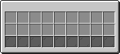
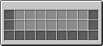
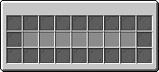

## MENUS
- ### Menu Page Functions
  - page_function: `"change_page"`
  - page: `<string>` menu:menus/`page`
  - page_function: `"close"`
  - go_back: `int`
  - tellraw: {}
    - text: `<string>`
    - selector: `@$`
  - playsound: {}
    - name: `<string>`
    - pitch: `number` 0..2
    - volume: `number` 0..2
   
```
custom_data={Menu:1b,interact:{page_function:"change_page",page:"mainmenu/main",tellraw:{text:{text:"Hello world!",color:"yellow"},selector:"@p"},playsound:{name:"minecraft:entity.player.hurt",volume:1,pitch:2}}}
```

- ### Inventory Menu
creates a list of menus that contain a list of items/loot-tables saved in a storage

- `data merge storage temp:menu_ui {temp:{storage:"",nbt:"",path:"",ui_type:"1-3",type:"item/loot",loot_path:"path"}}`
  - `storage`
  - `nbt`
  - `path`
  - `ui_type`

       1               | 2               | 3
      :------------------:|:---------------------:|:----------------------:
       |  |  
  - `item_modifier`
  - `function` ran with storage `temp:menu_ui`, to modify the slot use `$(menu_slot)`
- `function menu:inv_menu/main`

#### Items
```
storage > skyblock:temp [{id:"minecraft:diamond_sword",count:1},{id:"minecraft:stone",count:32},{id:"minecraft:golden_pickaxe",count:1},{id:"minecraft:diamond",count:12},{id:"minecraft:diamond",count:12},{id:"minecraft:diamond",count:12},{id:"minecraft:diamond",count:12},{id:"minecraft:diamond",count:12},{id:"minecraft:diamond",count:12},{id:"minecraft:diamond",count:12},{id:"minecraft:diamond",count:12}]
```

#### Loot Tables
